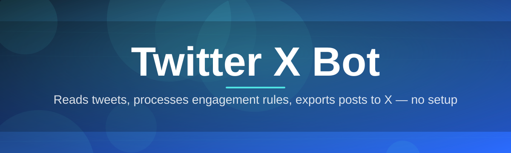
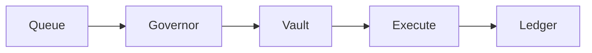

# twitter-x-bot-controller 🐦🎛️

  

*A calm, precise control room for everything you automate on X — built by one dev who got tired of janky scripts.*

  

> [!NOTE]
> This project is a labor of love, maintained in the evenings and weekends by a small crew of contributors who actually use it every day. If it saves you time, a star means the world to us.

## 🔭 Overview

**twitter-x-bot-controller** is a standalone Windows desktop application for orchestrating a Twitter X bot without wrestling with terminals, cron jobs, or fragile Python environments. Think of it as a mission-control panel — you define what your bot should do (post, reply, monitor, queue threads), and the controller handles scheduling, rate-limit awareness, and session persistence quietly in the background. No console windows flashing open. No mystery crashes at 3 AM.

This started as a personal itch. I was running a small X automation for a niche community and grew frustrated that every "bot controller" out there was either a bloated SaaS dashboard or a half-finished script buried in a gist. So I built the tool I actually wanted: something that feels like a real piece of software — fast, offline-capable where it matters, and honest about what it's doing to your account at every step.

Whether you're managing a single Twitter X bot for a hobby project, running scheduled content for a brand account, or experimenting with reply automation for community engagement, this controller is built for people who want *control*, not a black box. It's for tinkerers, indie marketers, community mods, and fellow developers who'd rather read a log line than guess why a post silently failed.

---

## ⚡ What It Actually Does

- **Queue Composer** — draft, stack, and reorder posts visually; the bot fires them in sequence without you babysitting a spreadsheet.

- **Adaptive Rate Governor** — watches your account's activity envelope and throttles itself before X's limits ever get close, so your Twitter X bot doesn't get flagged for looking robotic.

- **Reply Watchtower** — monitors chosen keywords, mentions, or threads and drafts context-aware responses that wait for your one-click approval (or run fully unattended if you trust it).

- **Session Vault** — keeps your login session encrypted locally on disk; no cloud relay, no third-party server sitting between you and X.

- **Multi-Persona Switching** — if you run more than one account, swap between bot profiles in a couple clicks instead of juggling browser tabs.

- **Live Activity Ledger** — a scrolling, timestamped log of every action taken, every retry, every skipped post — because "it just didn't work" is not a debugging strategy.

- **Scheduled Campaigns** — build multi-day posting arcs (threads, drip content, timed replies) and let the controller execute the timeline while you sleep.

- **Dry-Run Mode** — simulate an entire campaign without touching your real account, perfect for validating logic before it goes live.

> [!TIP]
> Turn on Dry-Run Mode the first time you build a campaign. It costs you nothing and catches 90% of "why did it post that" moments before they happen.

---

## 🚀 Getting Started

1. Visit the landing page via the download button above and grab the latest build for Windows.

2. Run the installer — it's a single `.exe`, no bundled runtimes, no surprise background services.

3. Launch **twitter-x-bot-controller**, sign your bot account in once through the secure session panel.

4. Build your first queue or campaign, hit **Dry-Run**, review the ledger, then flip the switch to live.

> [!IMPORTANT]
> Always test new automation logic against a secondary or test account first. Your primary Twitter X bot account's reputation is not a great place to debug.

---

## 🖥️ System Requirements

| Requirement | Details |
|---|---|
| OS | Windows 10 (64-bit) or Windows 11 |
| Dependencies | None — fully standalone, nothing to install separately |
| Disk Space | ~180 MB |
| RAM | 4 GB minimum, 8 GB comfortable for large campaigns |
| Network | Standard internet connection for X API/session traffic |

<strong>Why Windows-only for now?</strong>

 

The controller leans on native Windows UI components for that snappy, no-lag desktop feel. Cross-platform builds are on the roadmap (see Community section below) but they're not free to get right, and I'd rather ship a rock-solid Windows build than a shaky everything-build.

---

## 🧠 How It Works

The controller is built around a simple, honest pipeline — nothing gets sent to X without passing through a governor and a logger first.

1. **You define an action** — a post, reply, or campaign step — inside the Queue Composer.

2. **The Adaptive Rate Governor** evaluates timing against your account's recent activity.

3. **The Session Vault** signs the request using your locally-stored, encrypted session.

4. **The action executes** against X, and the result — success, retry, or skip — lands in the Live Activity Ledger.

> [!NOTE]
> The Governor step is not optional and cannot be disabled — it's the thing standing between your bot and an angry rate-limit response.

---

## 🩹 Common Pitfalls

**My bot logged in but posts aren't going out.**
Check the Live Activity Ledger first — it almost always tells you exactly why (throttled, queued, or waiting on a scheduled time you forgot about).

**The Adaptive Rate Governor feels too slow.**
It's intentionally conservative by default. You can loosen the pacing in Settings → Automation, but ease into it — aggressive pacing is how accounts get flagged.

**Reply Watchtower isn't catching a keyword I set.**
Keyword matching is case-insensitive but whitespace-sensitive — double check for a stray space or typo in your watch list.

**I switched Windows accounts and my session vanished.**
The Session Vault is encrypted per-machine-per-user by design, for security. You'll need to re-authenticate on the new profile.

**Dry-Run Mode shows different timing than live mode.**
Dry-Run compresses wait times so you can review a whole campaign quickly — live mode respects real scheduling. This is expected, not a bug.

**The app won't launch after a Windows update.**
Nine times out of ten this is a stale cached config. Delete the local settings cache from the app's data folder and relaunch — your campaigns aren't stored there, only preferences.

---

## 🎨 UI, Shortcuts & Themes

The interface is deliberately minimal — dark by default, because most bot operators run this thing late at night next to six other monitors.

- `Ctrl + N` — new queue item

- `Ctrl + Enter` — run selected campaign

- `Ctrl + D` — toggle Dry-Run Mode

- `Ctrl + L` — jump to Live Activity Ledger

- `Ctrl + ,` — open Settings

> [!TIP]
> Settings → Appearance lets you switch between **Midnight** (default dark), **Daybreak** (light), and **Highline** (high-contrast) themes. Highline was added specifically for accessibility feedback from the community — thank you to everyone who asked for it.

Badges for the curious about what's under the hood:

  

---

## 🤝 Contributing & Community

This project genuinely grows because people show up. Whether you're fixing a typo in the docs or shipping a whole new feature, contributions are read, appreciated, and usually merged faster than you'd expect from a side project.

> [!TIP]
> New to the codebase? Look for issues tagged `good-first-issue` — they're curated specifically to be approachable, not busywork.

- **Discussions** — open a thread for feature ideas, questions, or just to show off your campaign setups.

- **Roadmap** — publicly tracked; upcoming milestones include cross-platform builds, a plugin system for custom reply logic, and a visual campaign timeline editor.

- **Issues** — bug reports with a Ledger export attached get triaged first, since they come with real evidence.

- **Pull Requests** — please open a discussion before large changes so we can align on direction before you invest hours in code.

<strong>Ways to get involved right now</strong>

 

- Test the latest build against edge-case account setups (multi-persona, high-volume campaigns)

- Improve translations for the UI (English-first currently, more locales wanted)

- Help write clearer troubleshooting docs based on real issues you've hit

- Design feedback on the Highline accessibility theme

---

## 📄 License

Released under the [MIT License](LICENSE), 2026. Use it, fork it, build on it — just keep the license notice intact.

---

## ⚠️ Disclaimer

This tool is provided for legitimate automation, scheduling, and account-management purposes on X. You are responsible for complying with X's Terms of Service and applicable platform rules when operating your Twitter X bot. The maintainers of twitter-x-bot-controller are not responsible for account actions, suspensions, or platform policy enforcement resulting from how the tool is used.

---

